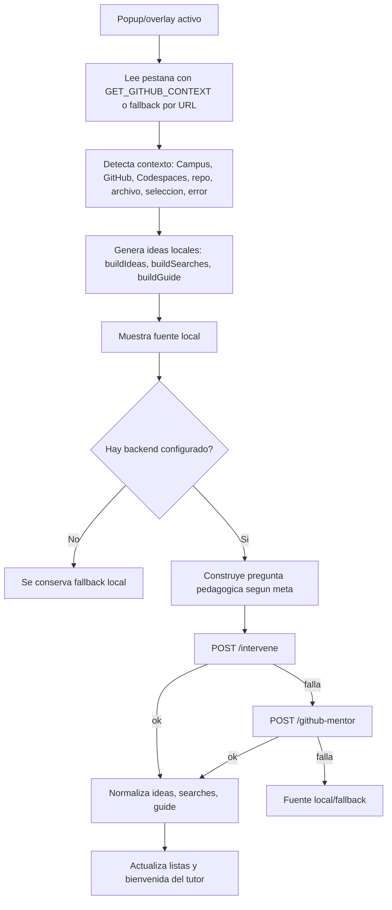
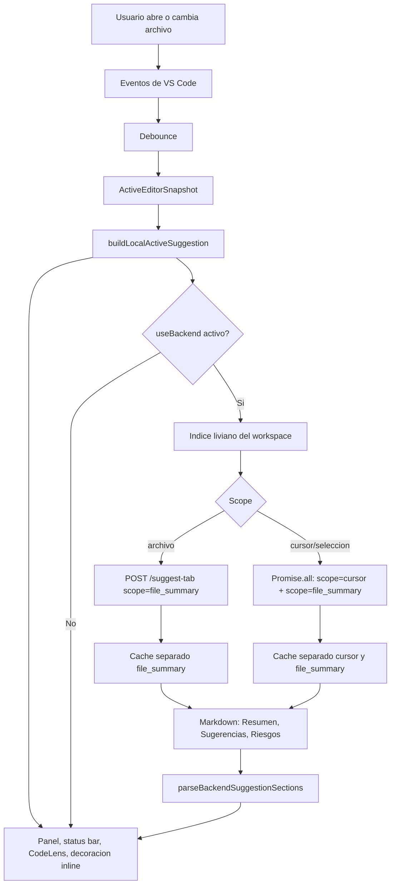
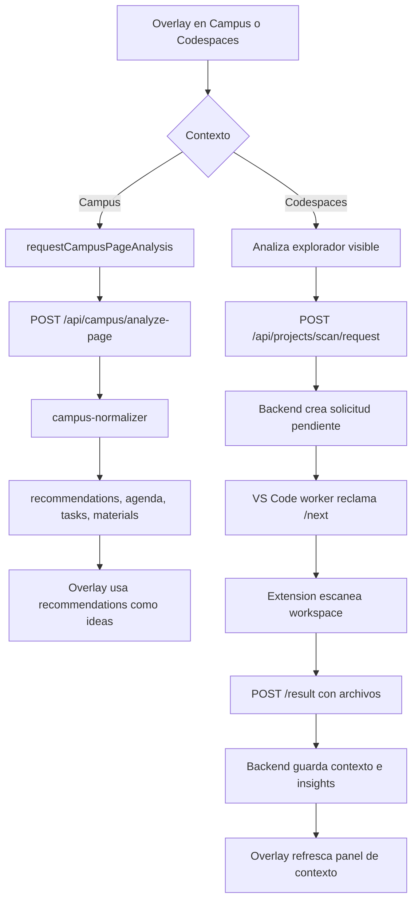

# Flujo workspace de la funcionalidad de sugerencias

Este flujo toma como alcance el workspace definido en `agente-proxy-azure.code-workspace`, que une tres carpetas:

- `browser-ext-prod`: extension de navegador para Campus Virtual, GitHub y Codespaces.
- `vscode-ext-prod`: extension de VS Code/Codespaces que lee el archivo activo y actua como worker de escaneo.
- `agente-proxy-azure`: backend Express que centraliza IA, politicas, cache, contexto de proyecto y analisis de Campus.

La funcionalidad de sugerencias no esta en un solo archivo. Se logro combinando tres rutas: sugerencias del tutor web, sugerencias del archivo activo en VS Code y recomendaciones de contexto de Campus/proyecto.

## Diagrama general del workspace

```mermaid
flowchart TD
  U[Usuario en Campus, GitHub, Codespaces o VS Code]

  subgraph BROWSER[browser-ext-prod]
    B1[Popup u overlay lee pagina activa]
    B2[Contexto: Campus, GitHub, Codespaces, archivo, error, seleccion]
    B3[Fallback local: ideas, busquedas, guia y recomendaciones visuales]
    B4[Consulta tutor backend: /intervene o /github-mentor]
    B5[Analisis Campus: /api/campus/analyze-page]
    B6[Analisis Codespaces: solicita scan del proyecto]
  end

  subgraph VSCODE[vscode-ext-prod]
    V1[Detecta editor activo, seleccion y cambios]
    V2[Construye snapshot del archivo activo]
    V3[Genera sugerencias locales inmediatas]
    V4[Publica en panel, status bar, CodeLens y decoracion inline]
    V5[Enriquece con /suggest-tab]
    V6[Worker reclama scan pendiente y envia archivos]
  end

  subgraph BACKEND[agente-proxy-azure]
    A1[/intervene y /github-mentor]
    A2[decision-engine aplica politica docente]
    A3[mentor-core crea heuristicas y prompt JSON]
    A4[/suggest-tab]
    A5[runSuggestTab o prompt Markdown por Azure]
    A6[/api/campus/analyze-page]
    A7[campus-normalizer genera recommendations]
    A8[/api/projects/scan/request]
    A9[Guarda contexto, historial, insights y resultados]
  end

  U --> B1
  U --> V1

  B1 --> B2 --> B3
  B3 --> B4 --> A1 --> A2 --> A3 --> B3
  B2 --> B5 --> A6 --> A7 --> B3
  B2 --> B6 --> A8 --> V6 --> A9

  V1 --> V2 --> V3 --> V4
  V3 --> V5 --> A4 --> A5 --> V4
```

## Flujo para determinar como se logro

1. Abrir `agente-proxy-azure.code-workspace` y confirmar que el sistema real esta dividido en `agente-proxy-azure`, `browser-ext-prod` y `vscode-ext-prod`.
2. Revisar `browser-ext-prod/popup/popup.js` para ver las sugerencias del popup: primero se crean localmente y luego se enriquecen con `/intervene` o `/github-mentor`.
3. Revisar `browser-ext-prod/services/backend.service.js` para ver el mismo patron en el overlay: construye pregunta, arma contexto y consulta el backend.
4. Revisar `browser-ext-prod/overlay/content-project.js` para ver como Campus convierte `analysis.recommendations` en ideas visibles y como Codespaces solicita escaneo al backend.
5. Revisar `vscode-ext-prod/package.json` para identificar comandos y settings de `adaceen.suggestions`.
6. Entrar a `vscode-ext-prod/src/extension.ts` y seguir `activate`, `scheduleActiveSuggestionRefresh`, `refreshActiveSuggestion`, `buildLocalActiveSuggestion` y `requestBackendActiveSuggestion`.
7. En el backend, seguir `agente-proxy-azure/src/routes/agent-routes.ts`: ahi viven `/suggest-tab`, `/intervene` y `/github-mentor`.
8. Para el tutor web, seguir `agente-proxy-azure/src/services/decision-engine.ts` y `mentor-core.ts`.
9. Para sugerencias del archivo activo, seguir `agente-proxy-azure/runSuggestTab.ts`, `tab-suggestion-prompt.ts` y `tab-fallbacks.ts`.
10. Para recomendaciones de Campus, seguir `agente-proxy-azure/src/routes/campus-routes.ts` y `campus-normalizer.ts`.
11. Para el puente navegador-backend-VS Code, seguir `project-scan-routes.ts` en el backend y el worker en `vscode-ext-prod/src/extension.ts`.

## Flujo 1: sugerencias del tutor web

Este flujo aparece en la extension de navegador, tanto en popup como en overlay.



Como se logro:

- El navegador captura contexto visible de Campus, GitHub o Codespaces.
- Genera sugerencias locales para que haya respuesta inmediata.
- Si el backend esta disponible, envia `question`, `max_items` y `context`.
- El backend pasa por `evaluateMentorIntervention`: primero arma heuristicas, luego aplica politica docente si hay sesion, y finalmente intenta IA con `runTextByMode`.
- La respuesta esperada es JSON con `ideas`, `searches`, `guide`, `welcome_message` y `analysis_summary`.
- Si IA o backend fallan, se mantiene el resultado local.

Archivos principales:

| Archivo | Papel |
| --- | --- |
| `browser-ext-prod/popup/popup.js` | Popup legado: lee contexto, crea ideas locales y consulta `/intervene` / `/github-mentor`. |
| `browser-ext-prod/services/backend.service.js` | Overlay: arma payload, consulta backend y normaliza resultado. |
| `agente-proxy-azure/src/routes/agent-routes.ts` | Expone `/intervene` y `/github-mentor`. |
| `agente-proxy-azure/src/services/decision-engine.ts` | Aplica politica docente, limites de pistas, bloqueo por contexto y selecciona fuente. |
| `agente-proxy-azure/src/services/mentor-core.ts` | Construye heuristicas, prompt JSON y parsea respuesta del modelo. |

## Flujo 2: sugerencias del archivo activo en VS Code

Este flujo ocurre dentro de la extension de VS Code/Codespaces.



Como se logro:

- La extension captura archivo, lenguaje, repo, linea, seleccion, texto visible y contenido recortado.
- Genera sugerencias locales por reglas: `TODO/FIXME`, `any`, `fetch`, `useEffect`, pruebas, dependencias, archivos largos y patrones por lenguaje.
- Publica el modelo local inmediatamente.
- Luego, si esta habilitado, arma un indice del workspace y consulta `/suggest-tab`.
- Para cursor quieto o seleccion, la extension dispara dos consultas IA en paralelo con `Promise.all`: una de foco (`suggestion_scope=cursor`) y otra de resumen estable del archivo (`suggestion_scope=file_summary`).
- El cache queda separado por foco (`cursor`/`selection`) y por resumen de archivo (`file_summary`), de modo que mover el cursor no invalida el resumen del archivo.
- El backend puede responder por cache, fallback deterministico, agentes locales o Azure; en scopes especializados usa prompts Markdown dedicados.
- La extension parsea el Markdown del backend y reemplaza la fuente local por `backend`.

Archivos principales:

| Archivo | Papel |
| --- | --- |
| `vscode-ext-prod/package.json` | Declara comandos y settings `adaceen.suggestions.*`. |
| `vscode-ext-prod/src/extension.ts` | Orquestador de captura, fallback local, backend, UI y cache. |
| `agente-proxy-azure/src/routes/agent-routes.ts` | Expone `/suggest-tab`. |
| `agente-proxy-azure/runSuggestTab.ts` | Flujo avanzado con agentes, herramientas y schema. |
| `agente-proxy-azure/src/services/tab-suggestion-prompt.ts` | Prompt Markdown simple para Azure o fallback. |
| `agente-proxy-azure/src/services/tab-fallbacks.ts` | Casos deterministas: PDF sin texto y conteo de notas. |

## Flujo 3: recomendaciones de Campus y contexto de proyecto

Este flujo conecta navegador, backend y extension de VS Code.



Como se logro:

- En Campus, el navegador envia contenido visible al backend.
- `campus-normalizer` extrae curso, tareas, fechas, materiales, enlaces y recomendaciones.
- En Codespaces, el navegador puede pedir un escaneo profundo del proyecto.
- El backend crea una solicitud pendiente.
- La extension de VS Code, actuando como worker, reclama esa solicitud, escanea archivos del workspace y devuelve el resultado.
- El backend guarda el contexto y lo usa para paneles, historial e insights.

Archivos principales:

| Archivo | Papel |
| --- | --- |
| `browser-ext-prod/services/campus.service.js` | Llama `/api/campus/analyze-page` y normaliza analisis de Campus. |
| `browser-ext-prod/overlay/content-project.js` | Usa recomendaciones de Campus y coordina escaneo de Codespaces. |
| `agente-proxy-azure/src/routes/campus-routes.ts` | Endpoint de analisis de Campus. |
| `agente-proxy-azure/src/services/campus-normalizer.ts` | Construye `recommendations`, agenda, tareas y materiales. |
| `agente-proxy-azure/src/routes/project-scan-routes.ts` | Cola de solicitudes de escaneo para VS Code. |
| `vscode-ext-prod/src/extension.ts` | Worker que reclama solicitudes y envia archivos al backend. |

## Decisiones de diseno que sostienen la funcionalidad

- **Fallback local primero:** popup, overlay y VS Code muestran algo util sin esperar IA.
- **Backend como enriquecedor:** el modelo mejora o contextualiza, pero no es el unico camino.
- **Separacion por canal:** navegador usa `/intervene` y `/github-mentor`; VS Code usa `/suggest-tab`.
- **Politicas docentes:** el tutor web puede limitar detalle, bloquear por falta de contexto y registrar telemetria.
- **Cache y control de concurrencia:** VS Code evita llamadas duplicadas y respuestas obsoletas.
- **Workspace como fuente de contexto:** VS Code aporta el codigo real del proyecto; navegador aporta la pagina y la actividad visible.
- **Formato estable:** el tutor web usa JSON estructurado; las sugerencias del editor usan Markdown en secciones.
- **No inventar:** los prompts, fallbacks y politicas insisten en declarar falta de contexto antes de responder.
