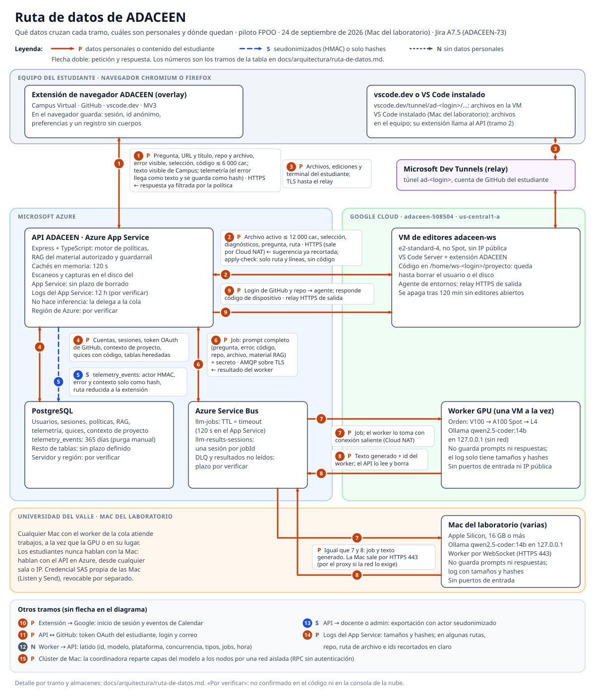
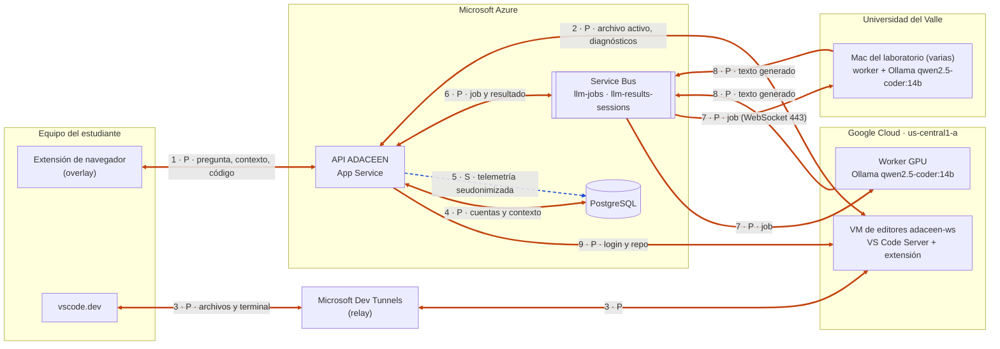

# Ruta de datos de ADACEEN

| | |
|---|---|
| Jira | A7.5 · ADACEEN-73 |
| Fecha | 24 de septiembre de 2026 |
| Rama | `feat/cierre-pendientes-jira`; tramo 9 (relay) actualizado en `feat/segunda-tanda-jira`; Mac del laboratorio, VS Code instalado y clúster de Mac (tramos 2, 7, 8, 12 y 15) en `feat/macs-laboratorio` |
| Sirve de insumo para | A4.3 (ADACEEN-50) y A5 (ADACEEN-11) |
| Decisión relacionada | [ADR-001: motor y cambio de arquitectura](adr-001-motor-y-arquitectura.md) |
| Criterio de cierre | «Un diagrama actualizado con qué datos cruzan cada tramo, cuáles son personales y cuánto tiempo se retienen (insumo para A4.3 y A5)» |

Este documento sigue los datos del piloto desde las extensiones hasta la base:
extensiones → API en Azure → Service Bus → servidor de inferencia (worker GPU en
Google Cloud o Mac del laboratorio de la universidad) → base.
Para cada tramo dice qué viaja, si es personal, cómo va cifrado, dónde queda y
cuánto tiempo. Todo sale del código de esta rama y de los documentos de
operación. Lo que no se pudo comprobar en el código ni en la consola de la nube
dice **por verificar**.

## Diagrama

Clases de dato (color, estilo de línea y letra, para que también se lea en gris):

- **P, personal:** identifica a la persona o es contenido suyo (código, preguntas, errores, nombre del repositorio, que suele llevar el login de GitHub).
- **S, seudonimizado:** el actor va como HMAC-SHA256 con la sal `TELEMETRY_SALT` y los textos solo como hash. Sigue siendo dato personal en sentido legal: quien tenga la sal y los ids de usuario puede volver a calcular el HMAC y reidentificar.
- **N, sin datos personales.**

Versión editable del mismo diagrama (sin los tramos 10 a 15):

Dos hechos que ordenan todo lo demás:

- **Con túnel, la extensión de VS Code no corre en el equipo del estudiante.**
  Se instala en el servidor de VS Code de la VM de editores y lee
  `ADACEEN_API_URL` del entorno de ese proceso (`deploy/gcp/workspaces/startup-ws.sh`).
  Sus llamadas al API salen de Google Cloud por Cloud NAT; el navegador solo
  dibuja el editor. **Con VS Code instalado** (por ejemplo, en las Mac del
  laboratorio), la extensión corre en ese equipo, el repositorio queda
  clonado allí y las llamadas del tramo 2 salen de ese equipo por HTTPS.
- **Azure no hace inferencia.** Con `AGENT_TARGET=queue` el API arma el prompt
  y lo deja en Service Bus; un servidor de inferencia (la GPU de Google Cloud o
  una Mac del laboratorio) lo toma con una conexión saliente y devuelve el
  texto por la misma vía.

## Tramo por tramo

| # | Tramo | Qué datos viajan | ¿Personales? | Cifrado en tránsito | Dónde se guardan | Retención |
|---|---|---|---|---|---|---|
| 1 | Extensión de navegador ↔ API | Pregunta; URL y título de la página; repo y ruta del archivo; actividad y fecha; error visible; selección y código (hasta 6 000 caracteres, `MAX_MENTOR_CODE_CHARS`); texto visible de Campus (hasta 180 000 caracteres) y documentos del curso para clasificar; telemetría v1.1 (el error llega como texto, máximo 300 caracteres); correo y contraseña o token de Google al iniciar sesión; URL y título de la pestaña activa; capturas para el «OCR visual». Identidad: `x-session-id` o `x-adaceen-client-id` (id aleatorio del navegador). Vuelta: respuesta del tutor ya filtrada por la política. | Sí (P) | HTTPS al host del App Service. El manifiesto de producción no admite hosts `http://` (prueba A12.7). | Servidor: tramos 4 y 5. Navegador (`chrome.storage`): sesión, id anónimo, preferencias y un registro de peticiones sin cuerpos. | Navegador: hasta cerrar sesión o desinstalar (por verificar). Servidor: tramos 4 y 5. |
| 2 | Extensión de VS Code (en la VM de editores o, con VS Code instalado, en el equipo del estudiante) ↔ API | `/suggest-tab`: archivo activo (hasta 12 000 caracteres, `MAX_TAB_CONTENT_CHARS`), selección, ruta, lenguaje, diagnósticos (hasta 10 de 300 caracteres), pregunta y repo. `POST /api/suggestions/apply-check`: ruta, lenguaje, modo y líneas o caracteres cambiados, sin código. `/api/quiz/after-accept`: código antes y después del cambio y texto de la sugerencia. Telemetría v1.1, con `metadata.editorHost` (`local`, `tunnel`, `codespaces` o `remote`) y `metadata.editorUi`. Archivos del proyecto cuando el overlay pide un escaneo. Vuelta: sugerencia ya recortada por el guardarraíl. | Sí (P) | HTTPS; sale de la VM por Cloud NAT o, con VS Code instalado, de la red del equipo. | Servidor: tramos 4 y 5. Id anónimo en el `globalState` de VS Code. Con VS Code instalado, el repositorio clonado queda en el equipo. | Igual que el tramo 1. Equipo del laboratorio: hasta que se borre la carpeta o se limpie el equipo. |
| 3 | vscode.dev ↔ Microsoft Dev Tunnels ↔ VM de editores | Archivos del proyecto, ediciones, terminal y salida de las extensiones. La identidad es la cuenta de GitHub del estudiante: el túnel `ad-<login>` está registrado en su cuenta. | Sí (P) | TLS entre cada extremo y el relay. Cifrado de extremo a extremo: por verificar en la documentación de VS Code. | Disco de la VM: `/home/ws-<login>/proyecto` (y `~/proyecto.bak-<fecha>` si se rehace el entorno); sesión del CLI de VS Code; el repositorio de GitHub del estudiante. | VM: hasta borrar el usuario (`userdel -r`) o el disco; no hay borrado automático. Relay de Microsoft: por verificar. |
| 4 | API ↔ PostgreSQL (cuentas y contexto) | Usuarios (correo, nombre, hash de contraseña), sesiones, políticas, material RAG, conteo de pistas por ejercicio, token OAuth de GitHub con login y correo, pestaña activa (URL y título), contexto de proyecto (ruta y fragmento de código), acciones de código (texto original y de reemplazo), escaneos (rutas y vistas previas), clasificaciones de documentos, quices (respuestas, texto libre y hasta 3 000 caracteres de código antes y después) y tablas heredadas (`intervention_telemetry`, `user_behavior_events`). | Sí (P) | TLS solo con `DATABASE_SSL_MODE=require`; `.env.example` trae `disable`. Valor en App Service: por verificar. | PostgreSQL. `.env.example` indica Azure Database for PostgreSQL Flexible Server; servidor y región: por verificar. | Sin plazo definido en el código (pendiente A4.3). |
| 5 | API → PostgreSQL (`telemetry_events`) | Eventos v1.1: actor y docente seudonimizados (HMAC-SHA256 con `TELEMETRY_SALT`, 20 hex), `exercise_hash`, error y contexto solo como hash SHA-256 (16 hex), extensión del archivo sin ruta, metadata por lista blanca de claves. | Seudonimizados (S) | Igual que el tramo 4. | Tabla `telemetry_events`. | `TELEMETRY_RETENTION_DAYS` = 365. La purga es manual: `npm run telemetria:purgar -- --confirmar`. |
| 6 | API ↔ Azure Service Bus | Job en `llm-jobs`: el prompt completo en `inputText` (pregunta, error, código, título o URL, repo y ruta, extractos del material RAG, instrucción de la política), `sharedSecret`, `diagnostics` (requestId, ruta, alcance) y hora. En trabajos de imagen, la captura en base64. Resultado en `llm-results-sessions`: texto generado, id del worker, secreto y hora. | Sí (P). No lleva id de usuario ni correo, pero el repo suele incluir el login de GitHub. | AMQP sobre TLS. | Colas de Service Bus. | Job: `timeToLive` = `QUEUE_REQUEST_TIMEOUT_MS` (120 000 ms en `.env.example`). Resultado: el API lo lee y lo borra; si ya no esperaba, queda hasta el TTL de la cola porque el worker no fija `timeToLive` (por verificar en Azure). Jobs inválidos: van a la cola de mensajes fallidos (DLQ) con su contenido; plazo por verificar. |
| 7 | Service Bus → servidor de inferencia (worker GPU o Mac del laboratorio) | El mismo job del tramo 6. | Sí (P) | AMQP sobre TLS. GPU: conexión saliente desde la VM por Cloud NAT; la VM no tiene IP pública ni puertos de entrada; credencial SAS `colab-worker` con `Listen` solo en `llm-jobs`. Mac del laboratorio: AMQP dentro de un WebSocket por HTTPS 443, por el proxy si la red lo exige; sin puertos de entrada; credencial SAS propia de las Mac (`worker-mac`, Listen y Send) en `~/.adaceen/worker.env` (600). | Memoria del proceso; Ollama en `127.0.0.1:11434`, sin red. Las imágenes se escriben en un directorio temporal y se borran al terminar. | El contenido no se guarda: el log del worker (`/var/log/adaceen-worker.log` en la GPU, `~/Library/Logs/ADACEEN/worker.log` en la Mac) solo registra tamaño, líneas y un hash SHA-256 de 12 hex del prompt y de la respuesta. Rotación del log de la GPU y registro propio de Ollama: por verificar; en la Mac, `worker-mac.sh reiniciar` rota los logs de más de 20 MB. |
| 8 | Servidor de inferencia → Service Bus → API | Texto generado (puede citar el código del estudiante), id del worker (`gce-v100`, `gce-a100`, `gce-l4`, `mac-lab07-m2`), secreto y hora. El id queda en `metadata.worker` del evento `tutor_decision` (tramo 5), sin datos del estudiante. | Sí (P) | AMQP sobre TLS (en las Mac, dentro de WebSocket por el 443); SAS con `Send` en `llm-results-sessions`. | Cola de resultados; después, caché del API. | Cola: ver tramo 6. Caché de `/suggest-tab`: 120 s en memoria. |
| 9 | API → agente de la VM de editores | Login de GitHub y repo. Vuelve el estado, el nombre del túnel, la URL de vscode.dev y el código de dispositivo de GitHub. | Sí (P) | Relay (A15.3): la VM sondea `GET /api/workspaces/agent/next` y responde en `POST /api/workspaces/agent/responses`, siempre por HTTPS de salida (Cloud NAT) hacia el App Service; `x-agent-token` en los dos sentidos. Dentro de la VM, el agente se llama a sí mismo en `127.0.0.1:8787`. | Memoria del agente y journal de systemd de la VM (una línea por preparación, sin el token). | Journal: por verificar. |
| 10 | Extensión de navegador → Google | Token de `chrome.identity` (correo y perfil) para iniciar sesión; eventos de Google Calendar con títulos y fechas de actividades. Solo el correo y el nombre llegan a ADACEEN (`/api/auth/google-login`). No disponible en Firefox. | Sí (P) | HTTPS. | Cuenta de Google del estudiante; correo y nombre en `users`. | La de Google; en ADACEEN, la del tramo 4. |
| 11 | API ↔ GitHub | OAuth por usuario (alcances por defecto: `repo codespace read:user user:email`), `GET /user` para leer el login, GitHub App (PR del devcontainer, Codespaces). | Sí (P) | HTTPS. | `github_user_tokens` (el token se guarda sin cifrado de aplicación) y `github_app_installations`. | Sin plazo; hasta que el estudiante revoque el acceso (proceso por verificar). |
| 12 | Servidor de inferencia → API (latido) | Id del worker, modelo, plataforma (`linux-x64`, `darwin-arm64`), concurrencia, tipos de trabajo, trabajos procesados, hora del último trabajo y del arranque. | No (N) | HTTPS con `x-worker-token`. | Memoria del App Service. | Hasta que se reinicia el proceso. |
| 13 | API → docente o administrador (exportación) | `telemetry_events` en JSONL o CSV. Con `--con-quices`, los intentos del mini quiz con el actor seudonimizado, extensión del archivo, tema y puntaje, sin código ni texto libre. | Seudonimizados (S) | HTTPS en `GET /api/telemetry/export`, solo para docente o administrador. El script `npm run telemetria:exportar` escribe en `exportes/`, que no se versiona. | Equipo de quien exporta. | Por definir en A5. |
| 14 | API → logs del App Service | JSON con tamaño y hash corto de entradas y salidas. En algunas rutas van en claro `repoFullName`, `filePath`, host y ruta de URLs, y los primeros 24 caracteres de ids de usuario y de sesión. | Sí (P) | Interno de Azure. | Registro del App Service. | 12 h con la configuración actual (nota de operación del 24 de septiembre). Otros destinos, como Log Analytics o Application Insights: por verificar. |
| 15 | Mac coordinadora ↔ Mac nodos (modo clúster) | Al cargar: los pesos del modelo (sin datos de estudiantes). Con cada petición: las activaciones intermedias del modelo, calculadas a partir del prompt del tramo 7. No viajan textos ni ids. | Derivados del contenido (P) | TCP sin cifrar ni autenticar (llama.cpp RPC), solo dentro de una red aislada entre las Mac (cable Thunderbolt o VLAN). | Memoria de cada nodo; en disco, solo la copia de los pesos del modelo (`~/.adaceen/cache-rpc`). | Activaciones: no se guardan. Pesos: hasta `worker-mac.sh desinstalar`. |

## Almacenes y retención

La misma información agrupada por lugar, que es como la necesita A4.3.

| Almacén | Qué guarda | Clase | Retención hoy | Por decidir (A4.3 / A5) |
|---|---|---|---|---|
| `chrome.storage` del navegador | Sesión, id anónimo, preferencias, registro de peticiones sin cuerpos. | P | Hasta cerrar sesión o desinstalar (por verificar). | Nada crítico. |
| Disco de la VM de editores | Código y sesión de VS Code de cada estudiante. | P | Hasta borrar el usuario o el disco. | Borrado al cerrar el piloto. |
| PostgreSQL: cuentas y contexto | Tramo 4. | P | Sin plazo. | Plazo y purga por tabla. |
| PostgreSQL: `telemetry_events` | Tramo 5. | S | 365 días, purga manual. | Programar la purga. |
| Disco del App Service | Escaneos del proyecto en `data/project-scans/<repo>/<usuario>/` y capturas en `data/project-screenshots/`. Las imágenes de `/run-image` pasan por `uploads/` y se borran al terminar cada petición. | P | Escaneos y capturas: sin plazo. | Plazo y purga. |
| Memoria del App Service | Salidas de `/suggest-tab` y análisis de Campus (claves en hash), latidos de los workers. | P | 120 s; latidos hasta reiniciar. | Nada. |
| Logs del App Service | Tramo 14. | P | 12 h (por verificar). | Sacar o pasar a hash repo, ruta e ids. |
| Service Bus | Prompts y respuestas en tránsito. | P | Job: 120 s. Resultados no leídos y DLQ: por verificar. | Fijar `timeToLive` en los resultados y una regla para la DLQ. |
| VM del worker GPU | Solo tamaños y hashes en el log. | N | Log sin rotación configurada (por verificar). | Rotación del log. |
| Mac del laboratorio (servidor) | Modelos de Ollama; log del worker con tamaños y hashes; credencial en `~/.adaceen/worker.env` (600). | N | Log hasta que se rote (`worker-mac.sh reiniciar`, más de 20 MB) o se desinstale. | Desinstalar y regenerar la clave `worker-mac` al cerrar el piloto. |
| Mac nodo del clúster | Copia de los pesos del modelo (`~/.adaceen/cache-rpc`); sin credenciales de Azure. | N | Hasta desinstalar. | Nada. |
| Equipo con VS Code instalado | Repositorio clonado del estudiante y ajustes de VS Code (sesión compartida). | P | Hasta borrar la carpeta; en el laboratorio, hasta que se limpie el equipo. | Pedir a los estudiantes que suban su trabajo a GitHub y borren la carpeta al salir. |
| `exportes/` de quien exporta | Telemetría y quices seudonimizados. | S | Por definir. | Reglas de custodia. |

## Lo que el código ya garantiza

- El worker (GPU o Mac del laboratorio) no guarda prompts ni respuestas: procesa en memoria, habla con Ollama por `127.0.0.1` y su log solo tiene tamaño, líneas y hash (`scripts/service-bus-ollama-worker.ts`, `src/services/diagnostics.ts`). En las Mac, Ollama también escucha solo en `127.0.0.1` (`deploy/mac/instalar-worker-mac.sh`).
- La telemetría v1.1 no guarda texto de errores, código, rutas ni correos: el servidor convierte el texto en hash al recibirlo y descarta la metadata que no está en la lista blanca (`src/services/telemetry.ts`).
- `apply-check` no recibe código, solo el tamaño del cambio.
- La exportación de quices no incluye el código (`code_context`) ni las respuestas abiertas (`scripts/lib/exportes.ts`).
- La exportación del API exige rol de docente o administrador.
- El worker no expone puertos y su credencial solo puede leer jobs y escribir resultados. Si la VM se pierde, basta con regenerar esa clave.
- En la VM de editores, los usuarios `ws-*` no pueden leer los metadatos de la instancia (iptables hacia `169.254.169.254`), donde están el token del agente y la clave del worker.

## Hallazgos y pendientes para A4.3 y A5

1. **Retención de datos personales.** Solo `telemetry_events` tiene plazo (365 días) y su purga se corre a mano. Las tablas del tramo 4, los escaneos y las capturas en el disco del App Service y el código en la VM de editores no tienen plazo ni borrado.
2. **Código del estudiante fuera del flujo principal.** `student_quizzes.code_context` guarda hasta 3 000 caracteres del código antes y después de cada cambio aceptado; `project_context_racks` y `project_code_actions` guardan fragmentos y reemplazos. El diccionario de telemetría no lo menciona.
3. **Logs del App Service con identificadores.** `/suggest-tab`, `/intervene` y el escaneo registran repo, ruta e ids recortados en claro. Retención de 12 h por verificar.
4. **Service Bus.** El worker no fija `timeToLive` al enviar el resultado: un resultado que el API ya no espera queda hasta el TTL de la cola. Por verificar ese TTL, si la cola manda a la DLQ los mensajes vencidos y cuánto guarda la DLQ.
5. **Cifrado hacia PostgreSQL.** Por verificar que App Service use `DATABASE_SSL_MODE=require`, además del cifrado en reposo, el servidor y la región.
6. **Regiones.** Google Cloud: `us-central1` (Estados Unidos). Región de App Service, Service Bus y PostgreSQL: por verificar. El consentimiento (A5) tiene que nombrarlas, y también los computadores de la universidad (Mac del laboratorio) cuando procesen trabajos.
7. **Token de GitHub.** Se guarda sin cifrado de aplicación y los alcances por defecto incluyen `repo`. Revisar si el piloto necesita ese alcance y cómo se revoca.
8. **Consentimiento de espacio de trabajo.** `user_workspace_consents` solo se consulta en las rutas de contexto de proyecto; `/suggest-tab` y el escaneo no lo revisan. Decidir si deben hacerlo.
9. **Más contexto del que prometía el anteproyecto.** El §7.2 habla de contexto «limitado y explícitamente permitido (selección, errores, instrucciones)»; VS Code manda el archivo activo, hasta 12 000 caracteres. El consentimiento debe decirlo o hay que reducir el envío.
10. **Relay de Dev Tunnels.** Por verificar si el tráfico va cifrado de extremo a extremo y qué conserva Microsoft.
11. **Camino Azure → agente de la VM de editores.** Resuelto con el relay (A15.3): el tramo 9 va por HTTPS de salida desde la VM. La cola del relay vive en la memoria del App Service (una instancia).
12. **Ollama y logs de la VM.** Por verificar que Ollama no registre prompts con la configuración actual y que haya rotación para `/var/log/adaceen-worker.log` y el journal.
13. **Trazas del SDK de agentes.** `runText.ts` y `runSuggestTab.ts` solo desactivan las trazas del SDK de OpenAI Agents cuando la clave es `dummy` o la URL base es local. Por verificar que el App Service no tenga una `OPENAI_API_KEY` real; si la tuviera, las trazas podrían salir hacia OpenAI.

## Cómo mantener este documento

- Si cambia un tramo, actualizar en el mismo commit la tabla, el bloque Mermaid y `ruta-de-datos.svg`. El SVG no usa fuentes ni imágenes externas; se valida con `python3 -c "import xml.dom.minidom; xml.dom.minidom.parse('docs/arquitectura/ruta-de-datos.svg')"`.
- La lista de campos y su sensibilidad está en `docs/telemetria/diccionario-eventos.md`, que se genera desde `src/services/telemetry-catalog.ts`.

## Fuentes

- Código: `src/routes/agent-routes.ts`, `src/routes/suggestion-routes.ts`, `src/routes/quiz-routes.ts`, `src/routes/campus-routes.ts`, `src/routes/project-scan-routes.ts`, `src/services/service-bus-agent.ts`, `src/services/telemetry.ts`, `src/services/telemetry-catalog.ts`, `src/services/diagnostics.ts`, `src/services/project-context.ts`, `src/db/schema.ts`, `src/db/database.ts`, `src/config/env.ts`, `scripts/service-bus-ollama-worker.ts`, `scripts/exportar-telemetria.ts`, `scripts/purgar-telemetria.ts`, `runText.ts`, `runSuggestTab.ts`, `browser-ext-prod/manifest.json`, `deploy/gcp/startup-script.sh`, `deploy/gcp/workspaces/startup-ws.sh`, `deploy/gcp/workspaces/nuevo-tunel.sh`.
- Documentos: `docs/service-bus-ollama-worker.md`, `docs/workspaces-tunnel.md`, `docs/telemetria/diccionario-eventos.md`, `docs/seguridad/permisos-extension.md`, `docs/seguridad/revision-overlay.md`; en `origin/master`, `docs/gcp-worker-infraestructura.md` y `docs/gcp-worker-operacion.md`.
- Nota de operación del worker GPU del 24 de septiembre de 2026 (retención de 12 h de los logs del App Service).
