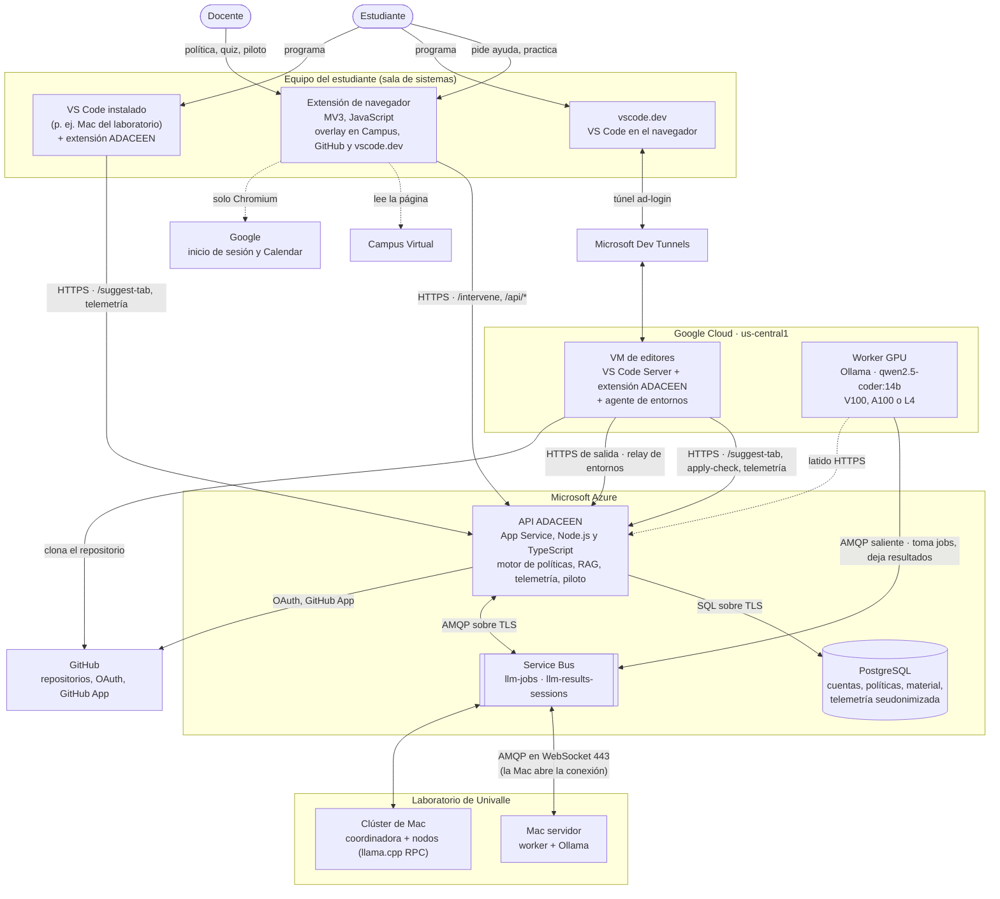
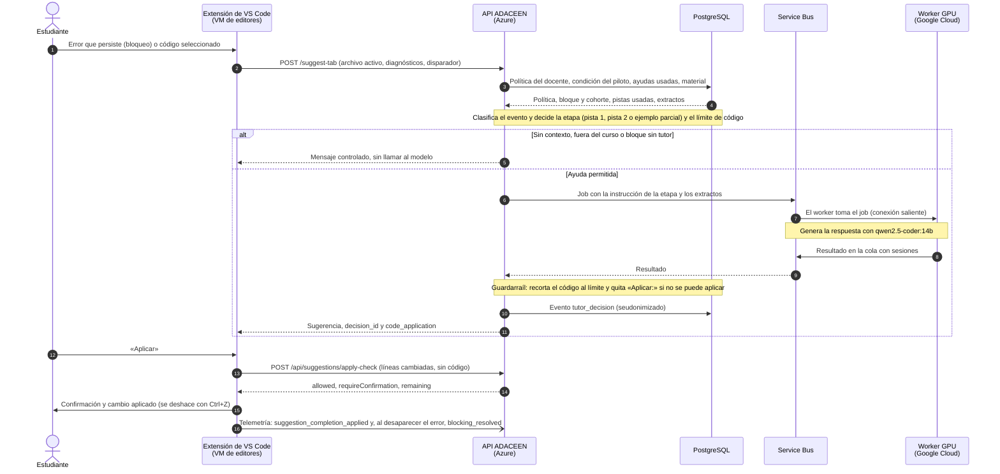
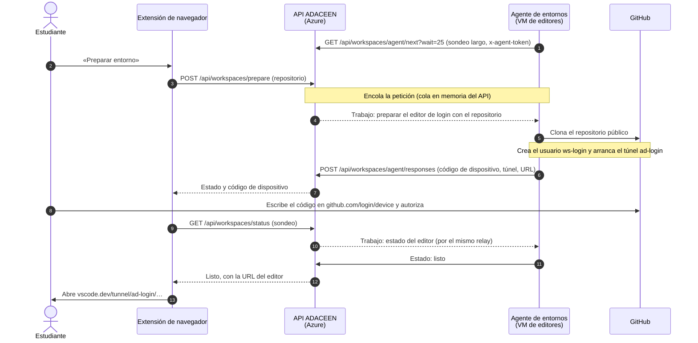

# Vistas de la arquitectura: contenedores y secuencias

| | |
|---|---|
| Jira | A9.6 · ADACEEN-88 (ADR); insumo de A16.2 · ADACEEN-130 (capítulo de arquitectura) |
| Fecha | 24 de septiembre de 2026 |
| Relacionados | [ADR-001](adr-001-motor-y-arquitectura.md), [ruta de datos](ruta-de-datos.md), [contrato de la API](contrato-api.md), [escenarios](../tutor/escenarios.md), [entornos por túnel](../workspaces-tunnel.md) |

El anteproyecto (5.4, objetivo específico 1) pide un documento de arquitectura
con vista C4 y diagramas de secuencia de las intervenciones. Este documento
tiene la vista de contenedores (nivel 2 del modelo C4) y dos secuencias: una
ayuda del tutor en VS Code y la preparación del entorno por el relay. La vista
de despliegue, con lo que viaja por cada tramo, está en la
[ruta de datos](ruta-de-datos.md).

Los diagramas están en Mermaid, que GitHub dibuja directamente. Las imágenes
para el documento de grado se generan con `mmdc` (Mermaid CLI) a partir de
estos mismos bloques.

## 1. Contenedores (C4, nivel 2)

| Contenedor | Tecnología | Responsabilidad | Código |
|---|---|---|---|
| Extensión de navegador | WebExtensions MV3 (Chromium y Firefox 128+), JavaScript sin dependencias | Overlay con el tutor, captura del contexto de la página, configuración del docente, piloto con y sin tutor, telemetría del overlay | `browser-ext-prod/` |
| Extensión de VS Code | TypeScript, API de extensiones de VS Code | Sugerencias sobre el archivo activo, señales de error, bloqueo y desbloqueo, aplicación de código con verificación, mini-quiz | `vscode-ext-prod/` (submódulo) |
| API ADACEEN | Node.js, Express y TypeScript en Azure App Service | Autenticación, motor de políticas, plantillas y guardarraíles, RAG, cola de inferencia, telemetría, piloto, KPIs, relay de entornos | `src/` |
| PostgreSQL | Azure Database for PostgreSQL | Estado del sistema y telemetría seudonimizada | `src/db/schema.ts` |
| Service Bus | Azure Service Bus (cola de trabajos y cola de resultados con sesiones) | Desacoplar el API de la GPU: el worker solo abre conexiones salientes | `src/services/service-bus-agent.ts` |
| Worker GPU | Node.js y Ollama en VMs con GPU de Google Cloud | Inferencia del modelo de lenguaje; latido cada 30 s | `scripts/service-bus-ollama-worker.ts`, `deploy/gcp/` |
| Mac del laboratorio | El mismo worker con Ollama como servicio de launchd; o un clúster (llama-server en la coordinadora, ggml-rpc-server en los nodos) | Inferencia intercambiable con la GPU, desde hardware de la universidad; solo conexiones de salida por el 443 | `deploy/mac/`, [worker-mac](../operacion/worker-mac.md) |
| VM de editores | e2-standard-4 sin IP pública, VS Code Server, túneles por estudiante | Entorno de programación de cada estudiante con ADACEEN instalado | `deploy/gcp/workspaces/` |

## 2. Secuencia: una ayuda del tutor en VS Code

En el overlay del navegador la secuencia es la misma hasta el guardarraíl, con
`POST /intervene` en lugar de `/suggest-tab`: el mismo motor decide la etapa,
el límite de pistas y el mensaje controlado, y el overlay no aplica código.

## 3. Secuencia: preparar el entorno por el relay (A15.3)

La VM no tiene IP pública ni puertos de entrada: todo lo inicia el agente con
HTTPS de salida por Cloud NAT. Si el agente no ha sondeado en 60 s, el API
responde de inmediato que el entorno no está disponible, en vez de esperar.

## Cómo mantenerlo

- Si cambia un contenedor o una interfaz, actualizar este documento, la
  [ruta de datos](ruta-de-datos.md) y el [contrato de la API](contrato-api.md)
  en el mismo commit.
- Imágenes para Word: `npx -p @mermaid-js/mermaid-cli mmdc -i <bloque>.mmd -o <salida>.png`.
