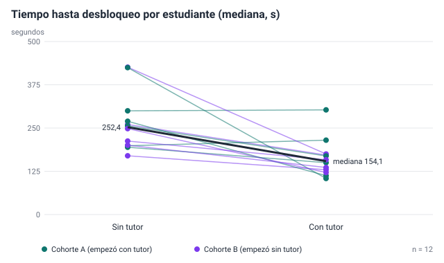
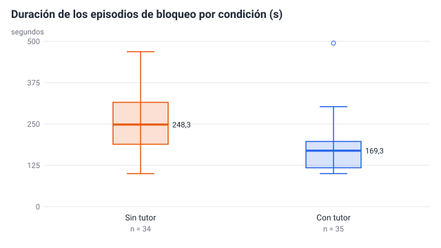
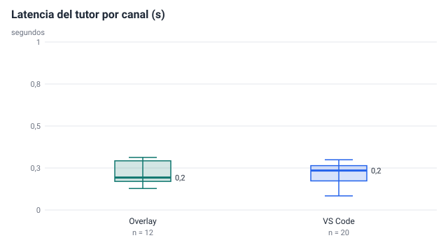
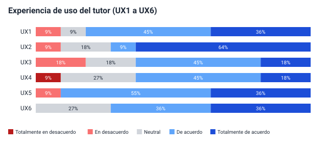
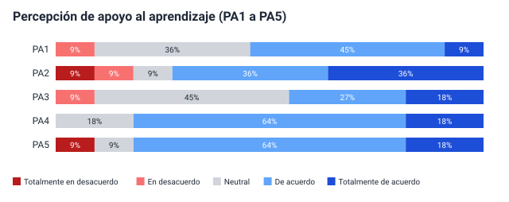
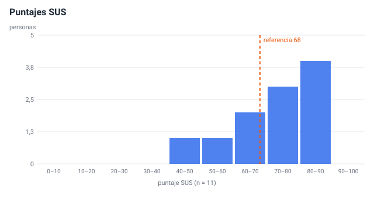
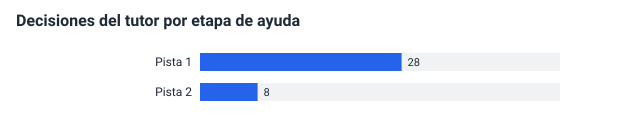
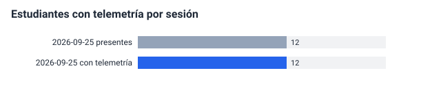

# Informe de KPIs del piloto — Ensayo técnico con estudiantes sintéticos

> **Datos simulados.** Este informe sale del ensayo técnico con estudiantes sintéticos: sirve para comprobar que la cadena funciona, no dice nada del tutor.

| | |
|---|---|
| Generado | 2026-09-25T00:51:51.246Z con `npm run piloto:analisis` |
| Telemetría | 360 eventos limpios de 364 (ensayo técnico, datos sintéticos) |
| Encuesta | 11 respuestas; columnas reconocidas: 26 |
| Participantes con consentimiento | 12 |
| Definiciones | docs/metricas/catalogo-kpis.md |

La columna «Lectura» es automática: dice el valor, el n y si cumple el umbral aprobado. La interpretación (qué significa y por qué pasó) va en el capítulo de resultados.

## 1. Tabla de KPIs

### Técnicos

| ID | KPI | Valor | n | Umbral | Cumple | Lectura |
|---|---|---|---|---|---|---|
| T1 ★ | Latencia del tutor (mediana) | 0,2 s | 32 | ≤ 8 s | Sí | Mediana de 0,2 s en 32 respuestas del modelo (overlay: 0,2 s (n = 12); vscode: 0,2 s (n = 20)). Cumple el umbral (≤ 8 s). |
| T2 | Latencia del tutor (p95) | 0,3 s | 32 | ≤ 15 s | Sí | Percentil 95 de 0,3 s en 32 respuestas. Cumple el umbral (≤ 15 s). |
| T3 | Respuestas del tutor sin fallo | 100 % | 32 | ≥ 95 % | Sí | 32 de 32 ayudas llegaron del modelo; 0 salieron por el respaldo (sin worker o con falla). Cumple el umbral (≥ 95 %). |
| T4 | Pérdida de eventos | 0,3 % | 287 | ≤ 2 % | Sí | Faltan 1 de 287 eventos esperados en 24 sesiones de cliente. Cumple el umbral (≤ 2 %). |
| T5 | Eventos duplicados | 0 % | 286 | ≤ 1 % | Sí | 0 eventos repetidos de 286 con seq. Cumple el umbral (≤ 1 %). |
| T6 | Sesiones con telemetría | 100 % | 12 | ≥ 90 % | Sí | 12 de 12 asistencias tienen telemetría con condición del piloto (1 sesión). Cumple el umbral (≥ 90 %). |
| T7 | Incidentes críticos en clase | sin dato | — | = 0 | — | Se registra a mano (registro): Incidentes de severidad 1 del registro del plan de soporte durante las sesiones. |
| T8 | Pruebas de humo | sin dato | — | ≥ 95 % | — | Se registra a mano (pruebas): Comprobaciones correctas de npm run demo:escenarios contra producción / comprobaciones totales. |
| T9 | Respuestas ancladas en material autorizado | 100 % | 36 | ≥ 80 % | Sí | 36 de 36 ayudas de eventos del curso llevaron fuentes autorizadas. Cumple el umbral (≥ 80 %). |
| T10 | Tiempo de instalación | sin dato | — | ≤ 15 min | — | Se registra a mano (registro): Mediana de los minutos desde abrir la guía hasta tener el overlay con sesión y el editor por túnel con ADACEEN, en la validación de la guía (A16.8). |
| T11 | Cumplimiento de privacidad, ética y seguridad | sin dato | — | ≥ 80 % | — | Se registra a mano (registro): Ítems cumplidos / ítems aplicables de la lista de cumplimiento (A13.4). |
| T12 | Eventos útiles en el diccionario | 36 eventos | 36 | ≥ 10 | Sí | 36 de 36 eventos del catálogo alimentan algún KPI. Cumple el umbral (≥ 10). |

### Experiencia de uso (UX)

| ID | KPI | Valor | n | Umbral | Cumple | Lectura |
|---|---|---|---|---|---|---|
| U1 ★ | Experiencia de uso del tutor | 3,99 / 5 | 11 | ≥ 4,0 / 5 | **No** | Promedio 3,99 / 5 en 11 personas. No cumple el umbral (≥ 4,0 / 5). |
| U2 | Usabilidad (SUS) | 70,9 puntos | 11 | ≥ 68 | Sí | SUS promedio 70,9 en 11 encuestas completas (mediana 70). Cumple el umbral (≥ 68). |
| U3 | Ayudas valoradas como útiles | 83,3 % | 12 | Descriptivo | Descriptivo | «Me sirvió» en 10 de 12 valoraciones; 0 ayudas sin valorar. KPI descriptivo, sin umbral. |
| U4 | Cambios del tutor aplicados en VS Code | 58,3 % | 24 | Descriptivo | Descriptivo | 14 cambios aplicados de 24 sugerencias mostradas en VS Code. KPI descriptivo, sin umbral. |
| U5 | Respuesta de la encuesta | 91,7 % | 12 | Descriptivo | Descriptivo | 11 encuestas válidas de 12 participantes con consentimiento. KPI descriptivo, sin umbral. |

### Pedagógicos

| ID | KPI | Valor | n | Umbral | Cumple | Lectura |
|---|---|---|---|---|---|---|
| P1 ★ | Reducción del tiempo hasta desbloqueo | 38,9 % | 12 | ≥ 20 % | Sí | Mediana con tutor 154 s y sin tutor 252 s en 12 estudiantes: reducción de 38,9 %. La diferencia es estadísticamente significativa (Wilcoxon exacto, p = 0,002). Sin los episodios corregidos desde otro archivo: 34 %. Cumple el umbral (≥ 20 %). |
| P2 | Episodios de bloqueo resueltos | 87,5 % | 77 | Descriptivo (acompaña a P1) | Descriptivo | Resueltos con tutor 87,5 % (35/40) y sin tutor 91,9 % (34/37). El valor es el de la condición con tutor. KPI descriptivo, sin umbral. |
| P3 | Participación | 100 % | 12 | ≥ 70 % | Sí | 12 de 12 participantes tuvieron actividad en los dos bloques. Cumple el umbral (≥ 70 %). |
| P4 | Percepción de apoyo al aprendizaje | 3,75 / 5 | 11 | ≥ 4,0 / 5 | **No** | Promedio 3,75 / 5 en 11 personas. No cumple el umbral (≥ 4,0 / 5). |
| P5 | Mejoras críticas implementadas | sin dato | — | ≥ 65 % | — | Se registra a mano (registro): Mejoras críticas implementadas / mejoras críticas identificadas en los hallazgos (A14.5). |
| P6 | Cumplimiento del límite anti-solución | 100 % | 14 | = 100 % | Sí | 14 de 14 cambios aplicados pasaron por la verificación; el guardarraíl recortó 24 respuestas y la política negó 0 de 14 aplicaciones. Cumple el umbral (= 100 %). |
| P7 | Bloqueos de la política y uso por etapa | 0 % | 36 | Descriptivo | Descriptivo | 36 decisiones (pista 1 28, pista 2 8); la política bloqueó 0. Aparte, 24 pedidos en el bloque sin tutor. KPI descriptivo, sin umbral. |
| P8 | Aciertos en el mini-quiz | sin dato | — | Descriptivo | — | Se calcula con los intentos del mini-quiz (npm run piloto:dataset). |

## 2. Tiempo hasta desbloqueo (P1, P2)

Mediana con tutor 154 s y sin tutor 252 s en 12 estudiantes: reducción de 38,9 %. La diferencia es estadísticamente significativa (Wilcoxon exacto, p = 0,002). Sin los episodios corregidos desde otro archivo: 34 %. Cumple el umbral (≥ 20 %).

| Análisis | Estudiantes pareados | Reducción |
|---|---|---|
| Principal (todos los episodios resueltos) | 12 | 38,9 % |
| Sin episodios corregidos desde otro archivo | 10 | 34 % |
| Solo cohorte A (empezó con tutor) | 6 | 39,3 % |
| Solo cohorte B (empezó sin tutor) | 6 | 36,1 % |

Prueba de Wilcoxon de rangos con signo (exacto): W+ = 3, W− = 75, n = 12, p = 0,002; correlación biserial de rangos = -0,92 (negativa: menos tiempo con tutor).

Análisis del cruzado AB/BA (Hills y Armitage, exacto): efecto del tutor -71,1 s (con − sin; negativo = menos tiempo con tutor), p = 0,002; efecto de periodo (bloque 1 − bloque 2) 5,2 s, p = 0,699; cohorte A 6 y B 6 estudiantes.

Si la reducción difiere mucho entre cohortes o el efecto de periodo es grande, hay efecto de orden (aprendizaje o cansancio entre bloques): se discute en los resultados.

Resueltos con tutor 87,5 % (35/40) y sin tutor 91,9 % (34/37). El valor es el de la condición con tutor. KPI descriptivo, sin umbral.

## 3. Latencia del tutor (T1, T2)

Mediana de 0,2 s en 32 respuestas del modelo (overlay: 0,2 s (n = 12); vscode: 0,2 s (n = 20)). Cumple el umbral (≤ 8 s).

## 4. Encuesta (U1, U2, P4, U5)

- Promedio 3,99 / 5 en 11 personas. No cumple el umbral (≥ 4,0 / 5).
- SUS promedio 70,9 en 11 encuestas completas (mediana 70). Cumple el umbral (≥ 68).
- Promedio 3,75 / 5 en 11 personas. No cumple el umbral (≥ 4,0 / 5).
- 11 encuestas válidas de 12 participantes con consentimiento. KPI descriptivo, sin umbral.

Las respuestas abiertas (AB1 a AB3) salen en `respuestas-abiertas.csv` para codificarlas a mano.

## 5. Uso de las intervenciones (P7)

36 decisiones (pista 1 28, pista 2 8); la política bloqueó 0. Aparte, 24 pedidos en el bloque sin tutor. KPI descriptivo, sin umbral.

## 6. Cobertura de telemetría (T6)

12 de 12 asistencias tienen telemetría con condición del piloto (1 sesión). Cumple el umbral (≥ 90 %).

## 7. Avisos del análisis

- 1 episodios de bloqueo cruzaron un cambio de bloque y no entraron en P1.
- 7 episodios de bloqueo no se cerraron (censurados): ver P2.
- 1 sesiones de cliente sin usuario en la ventana: su trabajo no tiene condición y no entra al análisis.
- KPIs manuales sin valor todavía: T7, T8, T10, T11, P5 (se registran en el plan del piloto).

## 8. Trazabilidad KPI → hallazgo → evidencia (A14.7)

La tabla completa está en `trazabilidad.csv`: las columnas «hallazgo» y «acción» se llenan al escribir los hallazgos (A14.5) y las mejoras (P5).
