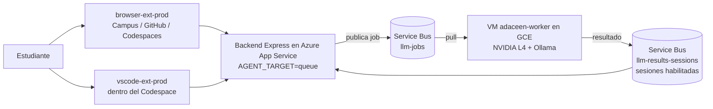

# Worker de inferencia en Google Cloud — qué se montó y por qué

Documento de arquitectura. Explica **qué existe hoy en GCP**, qué decisión hay
detrás de cada pieza y qué restricciones condicionaron el diseño.
Para los comandos del día a día, ver [gcp-worker-operacion.md](gcp-worker-operacion.md).

Proyecto: `adaceen-508504` · Región: `us-central1` · Zona: `us-central1-a`

---

## 1. Dónde encaja esto en ADACEEN

El worker de GCP **no es un servicio nuevo**: reemplaza la máquina que antes
ejecutaba `npm run worker:queue` (el notebook de Colab, o tu portátil).
La arquitectura *pull-based* no cambió en absoluto.

La consecuencia importante: **el worker nunca expone un puerto**. Solo abre
conexiones salientes hacia Service Bus. Por eso la VM puede vivir sin IP pública,
y por eso puedes mover el worker entre Colab, tu PC y GCP sin tocar ni el backend
ni las extensiones. Lo único que un worker necesita para entrar en juego es la
connection string de Service Bus y el `WORKER_SHARED_SECRET`.

Cuando hay varios workers conectados, Service Bus reparte los jobs entre ellos
(*competing consumers*). No hay coordinación que configurar.

---

## 2. La restricción que definió todo: cuenta de prueba vs. cuenta de pago

Antes de cualquier decisión técnica hubo un muro administrativo que conviene
dejar escrito, porque es la causa de varias elecciones del script.

**Compute Engine rechaza cualquier instancia con GPU adjunta mientras la cuenta
de facturación esté en estado "prueba gratuita".** No es un problema de saldo ni
de con qué crédito pagas: es un portón, no un peaje. La solicitud de aumento de
cuota `GPUS_ALL_REGIONS` ni siquiera se puede enviar desde una cuenta de prueba.

Los créditos disponibles son dos, y ninguno de los dos levanta esa restricción
por sí solo:

| Crédito | Monto | Vence | Alcance |
|---|---|---|---|
| Free Trial | $300 USD | 12 dic 2026 | "Uso específico" — excluye GPU |
| Google Developer Program (mensual) | $10 USD/mes | renovable hasta 12 sep 2027 | Todo GCP + Maps, sin restricción de producto |

Por eso el flujo real fue: **actualizar a cuenta de pago** → solicitar cuota de
GPU → crear la VM. Actualizar no genera cargo por sí mismo; solo se paga lo que
exceda el crédito.

Consecuencia de calendario que conviene no olvidar: los $300 del trial **vencen
el 12 de diciembre de 2026 aunque la cuenta ya sea de pago**. No tiene sentido
reservarlos para después. Del 13 de diciembre en adelante el presupuesto real es
$10/mes, que en Spot dan del orden de 60 h de GPU al mes.

### Por qué no se resolvió con "una CPU potente"

Se evaluó y se descartó por física, no por presupuesto. Generar un token exige
leer **todos los pesos del modelo desde memoria** en cada paso: el cuello de
botella es el ancho de banda de memoria, no los núcleos.

| Entorno | tok/s medidos | Ancho de banda efectivo |
|---|---|---|
| T4 (Colab) | ~25 | ~118 GB/s |
| CPU 2 vCPU (Colab) | ~2.8 | ~13 GB/s |
| CPU 8 vCPU (c3-standard-8) | ~4–8 estimado | ~20–40 GB/s |

Para igualar una T4 en CPU haría falta algo como un `c3-standard-88` (~$4/hora),
que se come el crédito mensual en dos horas y media y **sigue siendo más lento**
que una T4 a $0.15/h en Spot. El perfil `cpu` que existe en el script se dejó
únicamente como plan B para no quedar bloqueado esperando la cuota, y con un
modelo 3B; no tiene sentido económico para producción.

---

## 3. Recursos creados en GCP

### 3.1 La VM: `adaceen-worker`

| Atributo | Valor | Razón |
|---|---|---|
| Tipo de máquina | `g2-standard-8` (8 vCPU, 32 GB RAM) | Es el tipo que acompaña a la L4. Los 32 GB de RAM permiten *cargar* desde disco un modelo grande. |
| GPU | 1× NVIDIA L4, 24 GB VRAM | El punto dulce: un 14B va holgado, un 32B entra. Una T4 (16 GB) obligaría a bajar a 7B. |
| Imagen | Debian 12 | El instalador de driver de Google la soporta de fábrica. |
| Disco | 120 GB `pd-balanced` | Un 32B en Q4 pesa ~20 GB; con 50 GB no queda margen para probar modelos. |
| Aprovisionamiento | **SPOT** con `--instance-termination-action=STOP` | ~4× más barato. |
| Mantenimiento | `TERMINATE` | Obligatorio con GPU: no existe migración en vivo. |
| IP externa | ninguna (`--no-address`) | El worker solo hace conexiones salientes. |
| Modelo servido | `qwen2.5-coder:14b` | Definido por la metadata `model-text`. |

**Sobre SPOT.** Google puede desalojar la VM en cualquier momento. Se eligió
`STOP` en vez del `DELETE` por defecto para que **se conserve el disco**: volver
a encenderla toma segundos y no repite el `npm ci` ni la descarga del modelo. Y
el desalojo no corrompe nada: el worker hace `abandon` del mensaje, el job vuelve
a la cola y lo toma quien esté vivo. Ese comportamiento ya se verificó en la
práctica cuando Ollama estaba caído.

**Sobre la falta de IP pública.** Se comprobó en la consola: `EXTERNAL_IP` vacío.
Eso obliga a dos piezas de red que sí existen y que **no son opcionales**.

### 3.2 Salida a internet: Cloud NAT

Sin IP pública la VM no puede hacer `apt-get`, ni `npm ci`, ni descargar el
modelo de Ollama, ni hablar con Service Bus. Para eso están:

- Router: `adaceen-router` (región `us-central1`, red `default`)
- NAT: `adaceen-nat`, con `NAT_IP_ALLOCATE_OPTION=AUTO_ONLY` y alcance
  `ALL_SUBNETWORKS_ALL_IP_RANGES`

Es NAT de salida pura: permite que la VM inicie conexiones hacia afuera, pero
**no abre nada hacia adentro**. Sigue sin haber superficie de ataque.

> Detalle que causó confusión durante el montaje: en el log de arranque
> aparecieron errores `Cannot initiate the connection to packages.cloud.google.com
> ... (101: Network is unreachable)` sobre direcciones IPv6. Cloud NAT solo hace
> NAT de IPv4. El apt reintenta por IPv4 y termina resolviendo; por eso son
> advertencias (`W:`) y no errores fatales.

### 3.3 Acceso administrativo: IAP

Como no hay IP pública, el SSH entra por **IAP TCP forwarding**. La pieza que lo
permite es la regla de firewall `allow-iap-ssh` (ingress, `tcp:22`, red
`default`), que autoriza el rango de IAP. Es gratuita y conviene conservarla
incluso al destruir todo lo demás.

Todo acceso administrativo usa por tanto `--tunnel-through-iap`.

> Otro detalle del montaje: el error
> `4003: 'failed to connect to backend' (Failed to connect to port 22)` **no era**
> un problema de IAP ni de firewall. La VM estaba en estado `TERMINATED`. IAP
> reporta ese mismo error genérico cuando la máquina simplemente está apagada.
> Antes de depurar red, verificar el `status`.

---

## 4. Qué hace el startup script

`deploy/gcp/startup-script.sh` corre como root en cada arranque. Es
deliberadamente idempotente: comprueba antes de instalar, así que reencender la
VM no repite el trabajo pesado.

1. **Driver NVIDIA** — solo si `lspci` detecta una GPU y `nvidia-smi` no existe.
   Usa el instalador oficial de `GoogleCloudPlatform/compute-gpu-installation`.
   El mismo script sirve para el perfil `cpu` porque este paso simplemente no se
   ejecuta.
2. **Node 20 y Ollama** — cada uno tras comprobar que no esté ya instalado.
3. **Repo** — clona o actualiza `/opt/adaceen/repo` en la rama indicada por la
   metadata `branch`, y ejecuta `npm ci`.
4. **`.env.worker`** — se escribe con `umask 077` y `chmod 600`. Apunta a Ollama
   en `127.0.0.1:11434` (dentro de la propia VM, sin red de por medio).
5. **Descarga del modelo** — por la **API HTTP** de Ollama, no con `ollama pull`.
   Esto no es un capricho; son dos problemas reales:
   - los startup scripts corren sin `$HOME` y el CLI entra en panic;
   - aunque exportes `HOME=/root`, el CLI guardaría en `/root/.ollama` mientras
     el servicio corre como usuario `ollama` y lee de
     `/usr/share/ollama/.ollama`. El modelo quedaría donde nadie lo busca.

   Pidiéndoselo al servidor con `POST /api/pull`, queda en su propio directorio.
6. **Servicio systemd `adaceen-worker`** — `Restart=always`, arranca después de
   `ollama.service`, log en `/var/log/adaceen-worker.log`.
7. **Apagado por inactividad** — ver §5.

Esto es exactamente lo que faltaba en Colab: el worker **arranca solo al encender
la máquina**, sobrevive a que cierres el portátil, se reinicia si se cae y no
tiene corte a las 12 h.

### Los secretos

`AZURE_SERVICEBUS_CONNECTION_STRING` y `WORKER_SHARED_SECRET` viajan como
**metadata de instancia** (`sb-conn`, `worker-secret`), leídas por `create-vm.sh`
con `read -rsp`. Nunca aparecen en el historial del shell ni en el repositorio.

La credencial usada es la SAS dedicada `colab-worker`, con permisos mínimos:
`Listen` solo en `llm-jobs` y `Send` solo en `llm-results-sessions`. Si la VM se
pierde o se compromete, basta con regenerar esa clave — el resto del sistema no
se entera.

### Nombres de cola

El script escribe `JOBS_QUEUE_NAME=llm-jobs` y
`RESULTS_QUEUE_NAME=llm-results-sessions`. **Deben coincidir exactamente con lo
configurado en el App Service.** Ojo: los valores de ejemplo de `.env.example`
son otros (`adaceen-jobs` / `adaceen-results`); si alguna vez se copian a ciegas,
el backend publica en una cola que nadie escucha y los jobs mueren por timeout
sin ningún error visible.

---

## 5. Control de gasto

Tres mecanismos, en orden de eficacia real:

**1. Apagado automático por inactividad.** Un timer de systemd
(`adaceen-idle.timer`) corre cada 5 minutos y ejecuta `adaceen-idle-check`, que
compara la `mtime` de `/var/log/adaceen-worker.log` con el reloj. Como el worker
no escribe nada mientras espera jobs, esa marca es la última señal de actividad
*real*. Si supera el umbral, `shutdown -h now`.

Hay 20 minutos de gracia tras el arranque (vía `/proc/uptime`) para que la VM no
se apague antes de recibir el primer job.

El umbral viene de la metadata `idle-minutes`. El script lo crea con **30 min**;
en la instancia actual está puesto en **180 min**, más cómodo para sesiones de
trabajo largas y también más caro si se olvida encendida.

**2. Spot.** ~4× más barato que on-demand.

**3. Alertas de presupuesto.** Útiles, pero **solo avisan**; no apagan nada. No
son un mecanismo de control, son un detector de incendios.

### Lo que sigue costando con la VM apagada

El disco de arranque. 120 GB de `pd-balanced` son del orden de **$12/mes** aunque
la instancia esté `TERMINATED`. Por eso `teardown.sh` distingue entre `stop`
(pausa de horas o días) y `destroy` (ausencias largas: gasto a cero).

---

## 6. Rendimiento medido

| Escenario | Latencia |
|---|---|
| Clasificación **en caliente** (modelo ya en VRAM) | **~0.6 s** |
| Primer job tras arrancar el worker (cola despertando) | ~7.5 s |
| Primer job tras inactividad (carga del modelo en VRAM) | ~57 s |

El salto a 57 s es Ollama descargando el modelo de VRAM tras un periodo sin uso y
volviéndolo a cargar. Importa porque el backend abandona el job pasado
`QUEUE_REQUEST_TIMEOUT_MS`: con el valor por defecto de 120 s cabe, pero sin
holgura si además hay cola. En la VM el worker está en 180 s (metadata
`timeout-ms`); conviene subir el App Service al mismo valor.

---

## 7. Archivos del repositorio

| Archivo | Qué es |
|---|---|
| `deploy/gcp/create-vm.sh` | Crea la VM. Perfiles `cpu`, `t4`, `gpu`/`l4`, `l4x2`. Pide los secretos por stdin. |
| `deploy/gcp/startup-script.sh` | Provisiona la VM en cada arranque. Se sube como metadata. |
| `deploy/gcp/teardown.sh` | `status`, `stop` o `destroy`. |
| `docs/gcp-worker-operacion.md` | Comandos de operación diaria. |

Los perfiles con GPU (`t4`, `l4`, `l4x2`) requieren cuenta de pago y cuota
aprobada. `l4x2` además necesita cuota global de 2 GPUs.

---

## 8. Riesgos conocidos

- **Desalojo de Spot durante una demo.** Es el riesgo operativo más real. Para
  una sustentación conviene verificar el estado justo antes; reencender toma
  ~40 s porque el disco conserva todo.
- **La VM no se enciende sola.** Tras un apagado por inactividad, el primer job
  que llegue morirá por timeout. Hay que encenderla a mano antes de trabajar.
- **`git reset --hard FETCH_HEAD`** en cada arranque: cualquier cambio hecho a
  mano dentro de `/opt/adaceen/repo` se pierde al reiniciar. Es intencional, pero
  sorprende si editaste algo ahí para depurar.
- **La rama está fijada** en el startup script (`BRANCH`, por defecto
  `claude/amazing-fermi-f6a23q`). Al hacer merge a `master` hay que actualizar la
  metadata `branch` o el worker seguirá corriendo código viejo.
