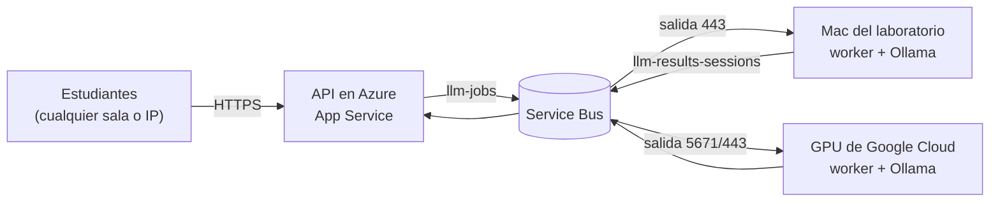
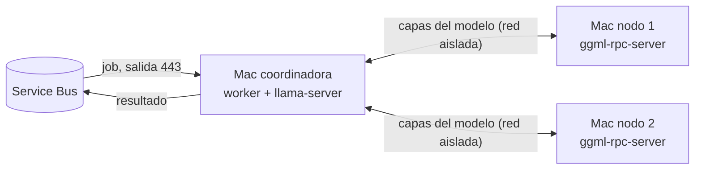

# Mac del laboratorio como servidores de inferencia

| | |
|---|---|
| Jira | A15.10 · ADACEEN-151 (Mac del laboratorio) · relacionada con A9.6, A15.3 y A15.4 |
| Para quién | Quien prepara y opera las Mac del laboratorio de la universidad |
| Scripts | `deploy/mac/instalar-worker-mac.sh`, `deploy/mac/worker-mac.sh`, `deploy/mac/velocidad.sh`, `deploy/mac/adaceen-mac.ejemplo.env` |
| Relacionados | [Worker de la cola](../service-bus-ollama-worker.md) · [desarrollo local](../local-development.md) · [runbook](runbook.md) · [prerrequisitos](prerrequisitos.md) · [contingencia](contingencia.md) · [ruta de datos](../arquitectura/ruta-de-datos.md) |

## 1. Qué hace una Mac del laboratorio

El worker de la cola ya existía (`npm run worker:queue`): cualquier máquina con
Ollama y la credencial de Service Bus puede atender trabajos de producción, y
Service Bus los reparte entre todas las que estén escuchando. Una Mac del
laboratorio es una más, igual que la GPU de Google Cloud:



- Los estudiantes nunca hablan con la Mac: hablan con Azure, desde el
  laboratorio, otra sala o su casa.
- La Mac solo abre conexiones **de salida** por HTTPS (443). No necesita IP
  pública, puertos abiertos ni excepciones en el firewall de la universidad.
  Por eso el worker usa `SERVICE_BUS_TRANSPORT=websockets`: el mismo AMQP de
  Service Bus dentro de un WebSocket por el 443, y por el proxy si la red lo
  exige.
- Ollama escucha solo en `127.0.0.1`: nadie en la red puede usar el modelo
  directamente.
- Se pueden mezclar Mac y GPU. Si una se apaga, sus trabajos pendientes vuelven
  a la cola y los toma otra.

El instalador tiene cuatro roles:

| Rol | Para qué | Qué queda corriendo |
|---|---|---|
| `servidor` (por defecto) | Atender a estudiantes de cualquier sala a través de Azure | Ollama y el worker de la cola |
| `local` | Una Mac que trabaja sola, con el modo local de siempre (`npm run dev:local`), por ejemplo sin internet | Ollama y el backend local en `127.0.0.1:3000` |
| `nodo` y `coordinador` | Juntar la memoria de varias Mac para correr un modelo que no cabe en una sola (sección 9) | En cada nodo, `ggml-rpc-server`; en la coordinadora, `llama-server` con el modelo repartido y el worker de la cola |

El rol `local` es el flujo de [desarrollo local](../local-development.md) como
servicio. La extensión de VS Code de esa Mac lo encuentra sola; la del
navegador sigue en producción hasta que alguien elija la URL local a mano. El
backend local guarda los datos en memoria (se pierden al reiniciar): **no sirve
para las sesiones del piloto**.

## 2. Requisitos de cada Mac

| Qué | Mínimo | Por qué |
|---|---|---|
| Chip | Apple M1 o posterior | En una Mac con Intel, Ollama corre solo en la CPU y la latencia pasa de 8 s |
| macOS | 14 Sonoma o posterior | Lo exige Ollama |
| Memoria | 16 GB | El modelo del piloto (`qwen2.5-coder:14b`) ocupa unos 9 GB de memoria unificada |
| Disco libre | 12 GB (19 GB con imágenes) | Modelo de texto de unos 9 GB y de imágenes de unos 6 GB |
| Red | Salida HTTPS (443) | A Service Bus (`*.servicebus.windows.net`) y al App Service; para instalar, también a `registry.ollama.ai`, `github.com` y `nodejs.org` |
| Cuenta | Usuario normal | Con clave de administrador solo si se instala en modo sistema (sección 4) |

Con la memoria, el instalador elige cuántos trabajos atiende la Mac a la vez y
si también atiende preguntas con captura de pantalla:

| Memoria | Trabajos | A la vez | Nota |
|---|---|---|---|
| 8 GB | — | — | No sirve para el piloto. Con `--modelo=qwen2.5-coder:7b` puede atender fuera de las sesiones del piloto |
| 16 a 31 GB | Texto | 1 | Las preguntas con captura las atiende otro servidor (la GPU o una Mac de 32 GB) |
| 32 a 63 GB | Texto e imágenes | 2 | Carga los dos modelos a la vez |
| 64 GB o más | Texto e imágenes | 4 | |

`--tipos` y `--concurrencia` cambian esos valores. Si ningún servidor vivo acepta
imágenes, el monitor del piloto lo avisa.

**Velocidad.** Lo que más pesa en la generación es el ancho de banda de la
memoria. Como orientación, con `qwen2.5-coder:14b`:

| Servidor | Generación |
|---|---|
| Mac con chip base (M1 a M4) | Unos 7 a 11 tokens/s |
| Mac con chip Pro | Unos 14 a 25 tokens/s |
| Mac con chip Max | Unos 30 a 40 tokens/s |
| V100 de Google Cloud | 66 tokens/s (medido el 24 de septiembre) |

Las cifras de las Mac son aproximadas. El umbral del piloto es una mediana de
8 s o menos, y una Mac con chip base sola no lo alcanza. El instalador mide la
velocidad real de cada Mac al terminar: estima una petición de VS Code con unos
2000 tokens de entrada y 200 de respuesta. `worker-mac.sh velocidad` repite la
medida. La caché de Ollama acelera las peticiones seguidas sobre el mismo
archivo, así que la latencia real puede quedar por debajo de la estimación.

Si la estimación pasa de 8 s, hay tres salidas:

1. **Respaldo de la GPU** (`--respaldo`): la Mac solo toma los trabajos que los
   demás servidores no alcanzan a tomar, porque están ocupados o apagados.
   Mientras la GPU esté libre, casi todo le llega a ella.
2. **Mac Pro o Max:** confirmar la latencia con `npm run medir:latencia` antes
   del piloto.
3. **Un modelo menor en todos los servidores:** conserva la comparabilidad. Es
   una decisión metodológica para acordar con el director y registrar.

## 3. Una sola vez, en Azure

1. **Política de Service Bus solo para las Mac** (con Listen y Send; nunca
   `RootManageSharedAccessKey` en una máquina del laboratorio):

   ```bash
   az servicebus namespace authorization-rule create --resource-group <grupo> --namespace-name <namespace> --name worker-mac --rights Listen Send
   az servicebus namespace authorization-rule keys list --resource-group <grupo> --namespace-name <namespace> --name worker-mac --query primaryConnectionString -o tsv
   ```

   Si una Mac se pierde o termina el semestre, se regenera la clave de esa
   política (`az servicebus namespace authorization-rule keys renew … --key PrimaryKey`)
   y las GPU de Google Cloud siguen funcionando con la suya.
2. **Latido:** el App Service debe tener `WORKER_HEARTBEAT_TOKEN`
   (`/api/health` → `"worker_heartbeat_configured": true`).
3. **Archivo de configuración:** copia `deploy/mac/adaceen-mac.ejemplo.env` a
   una memoria USB como `adaceen-mac.env` y completa la cadena de conexión, el
   `WORKER_SHARED_SECRET` y el `WORKER_HEARTBEAT_TOKEN`. Tiene secretos: no lo
   subas al repositorio ni lo dejes en una carpeta compartida.

## 4. Instalar en cada Mac

1. Abre **Terminal** en la sesión gráfica de la Mac (no por SSH).
2. Consigue el repositorio PDC en la rama que usa producción: `git clone` o,
   si la Mac no tiene `git`, «Code → Download ZIP» en GitHub y descomprímelo.
3. Instala:

   ```bash
   cd PDC
   bash deploy/mac/instalar-worker-mac.sh --equipo=07 --config=/Volumes/USB/adaceen-mac.env
   ```

   `--equipo=07` deja el id `mac-lab07-m2` (el chip se detecta). Así aparece en
   el monitor y en el informe como «Mac del laboratorio - M2».

El instalador:

1. Revisa el chip, macOS, la memoria, el disco y la salida a Azure.
2. Usa el Node 22 y el Ollama que ya tenga la Mac. Si no están, los descarga en
   `~/.adaceen` sin pedir clave de administrador, y comprueba su suma SHA-256.
3. Instala las dependencias (`npm ci`) y descarga el modelo. La primera vez son
   unos 9 GB.
4. Deja la configuración en `~/.adaceen/worker.env` con permisos 600. El
   `.env.worker` del repositorio no se toca.
5. Crea los servicios de launchd, los enciende y precarga el modelo en memoria.
6. Espera a que Azure vea el latido de la Mac.

Si la Mac ya tiene abierta la app de Ollama, el instalador la reutiliza en vez
de crear otro Ollama. Para que la app no descargue el modelo de la memoria a
los 5 minutos, corre `launchctl setenv OLLAMA_KEEP_ALIVE -1` y reinicia la app.
Si prefieres que ADACEEN maneje Ollama, cierra la app, quítala de los elementos
de inicio y vuelve a correr el instalador.

**Modo sesión o modo sistema:**

| | Sesión (por defecto) | Sistema (`--sistema`) |
|---|---|---|
| Permisos | Usuario normal | Clave de administrador |
| Corre | Mientras la sesión de ese usuario esté abierta (con la pantalla bloqueada también) | Desde que la Mac enciende, aunque nadie inicie sesión |
| Servicios | `~/Library/LaunchAgents` | `/Library/LaunchDaemons` (los procesos corren con el usuario que instaló, no como root) |

Si la Mac tiene FileVault activo, después de reiniciar hay que desbloquear el
disco antes de que arranque cualquier servicio.

Otras opciones: `--respaldo`, `--rol=local`, `--proxy=http://host:puerto`,
`--transporte=amqp`, `--carpeta-modelos=<dir>` y `--simular=<dir>`. Esta última
no toca el sistema: solo escribe los archivos para revisarlos. `--ayuda` las
lista todas.

## 5. Qué queda instalado

| Qué | Dónde |
|---|---|
| Servicios | `co.edu.univalle.adaceen.ollama`, `co.edu.univalle.adaceen.worker` (rol servidor), `co.edu.univalle.adaceen.local` (rol local), `co.edu.univalle.adaceen.nodo` (nodo) o `co.edu.univalle.adaceen.llama` y `…worker` (coordinadora) |
| Configuración y secretos | `~/.adaceen/worker.env` (600) |
| Qué se instaló, sin secretos | `~/.adaceen/instalacion.env` |
| Node y Ollama descargados | `~/.adaceen/node`, `~/.adaceen/ollama` (solo si la Mac no los tenía) |
| llama.cpp (cluster) | `~/.adaceen/llama.cpp` (con su versión en `VERSION`) y, en los nodos, la copia de los pesos en `~/.adaceen/cache-rpc` |
| Modelos | `~/.ollama/models` (o `--carpeta-modelos`) |
| Logs | `~/Library/Logs/ADACEEN/` (`worker.log`, `ollama.log`, `local.log`, `llama.log`, `nodo.log`; también en la app Consola) |

El worker corre dentro de `caffeinate -ims`. Mientras corre, la Mac no se
duerme, aunque la pantalla sí se puede apagar.

## 6. Operación diaria

```bash
bash deploy/mac/worker-mac.sh estado      # servicios, modelo cargado y latido en Azure
bash deploy/mac/worker-mac.sh detener     # apaga; no vuelve a arrancar hasta "iniciar"
bash deploy/mac/worker-mac.sh iniciar
bash deploy/mac/worker-mac.sh reiniciar   # también rota los logs de más de 20 MB
bash deploy/mac/worker-mac.sh logs        # worker (o: logs ollama, local, llama, nodo)
bash deploy/mac/worker-mac.sh velocidad   # cuánto tarda una petición típica en esta Mac
```

**Antes de cada sesión del piloto:**

1. Corre `estado` en cada Mac y confirma que Azure la ve viva. Si no, `iniciar`.
2. Desde tu equipo, `curl -s $BACKEND/api/agent/backend` lista los servidores
   vivos en `listening[]`. Cada Mac trae `platform: "darwin-arm64"`, su
   concurrencia y los tipos de trabajo que acepta.
3. Durante la sesión, `npm run piloto:monitor` muestra una línea como
   `servidores 4 (Mac del laboratorio - M2 x3, Google Cloud - V100 x1)`. Avisa si
   los servidores usan modelos distintos o si ninguno acepta imágenes.

**Consistencia del piloto:** todos los servidores de una sesión del piloto deben
usar `qwen2.5-coder:14b`, el mismo modelo de la GPU. Cada decisión del tutor
guarda qué servidor la atendió (`metadata.worker`). El informe separa la
latencia por servidor (tabla «Servidor de inferencia» en la sección 3), pero el
umbral de 8 s se juzga sobre el total.

## 7. Red, proxy y seguridad

- **Proxy:** el instalador toma el proxy HTTPS de la configuración de red de la
  Mac o el de `--proxy`, y lo guarda en `worker.env`. Tanto Service Bus (por
  WebSocket) como el latido salen por él. Si la Mac usa un archivo PAC, pasa el
  proxy con `--proxy`.
- **Qué pasa por la Mac:** el trabajo del tramo 7 de la
  [ruta de datos](../arquitectura/ruta-de-datos.md), es decir, el texto de la
  pregunta y el fragmento de código. Se procesa en memoria y no se guarda. El
  log solo registra tamaños y un hash. El consentimiento informa que el
  procesamiento puede ocurrir en computadores de la universidad.
- **Credenciales:** solo `worker.env` (600) las tiene. Un estudiante que use la
  Mac con otra cuenta no puede leerlas. `desinstalar` borra el archivo.
- **Laboratorios con el disco congelado** (por ejemplo, Deep Freeze): la
  instalación se pierde al reiniciar. Pide a sistemas que la hagan en modo
  descongelado o en una partición que se conserve.

## 8. Problemas frecuentes

| Síntoma | Causa probable | Qué hacer |
|---|---|---|
| El instalador dice «no hay salida HTTPS» a Service Bus | Red del laboratorio o proxy | Probar `curl -I https://<namespace>.servicebus.windows.net/`; pasar `--proxy`; pedir a sistemas la salida al 443 |
| `estado`: «Azure: … no aparece» | Sin `WORKER_HEARTBEAT_TOKEN`, token distinto o el latido no sale | Revisar el token en `worker.env` y en el App Service; `logs` → `worker.heartbeat.failed` |
| `estado`: servicio «cargado pero sin proceso» | El proceso falla al arrancar | `logs`; en `worker.log` el primer error dice qué falta |
| Latencia alta en una Mac | Chip base, modelo fuera de memoria o poca memoria | `velocidad`; `estado` → «modelos en memoria»; con 16 GB, concurrencia 1 y solo texto; si sigue alta, `--respaldo` junto a la GPU |
| Se detiene al cerrar sesión | Modo sesión | Dejar la sesión abierta (con la pantalla bloqueada) o reinstalar con `--sistema` |
| `launchd no acepto …` | El instalador se corrió por SSH | Correrlo en Terminal dentro de la sesión gráfica |
| La descarga del modelo no avanza | La red bloquea o limita `registry.ollama.ai` | Copiar `~/.ollama/models` desde otra Mac que ya lo tenga y volver a correr el instalador |
| Clúster: `llama-server` no termina de cargar | Un nodo apagado, IP equivocada o versiones distintas de llama.cpp | `estado` en la coordinadora (nodos alcanzables); `logs llama`; misma `--version-llama` en todas |
| Clúster: el nodo no escucha en su IP | La IP no está asignada a esta Mac (por ejemplo, el Puente Thunderbolt con IP automática) | Poner IP fija en el Puente Thunderbolt y reinstalar el nodo con esa IP |

## 9. Modo clúster: juntar la memoria de varias Mac

Service Bus reparte trabajos completos: cada servidor necesita el modelo
entero. Para correr un modelo que no cabe en una Mac (por ejemplo
`qwen2.5-coder:32b`, de unos 20 GB, en Mac de 16 GB), varias Mac se reparten
las capas del modelo con llama.cpp RPC. La cola sigue siendo la puerta: la Mac
coordinadora toma los trabajos y usa la memoria de los nodos.



**Lo que hay que saber antes:**

- **Es más lento, no más rápido.** Cada token pasa por todas las Mac, una tras
  otra, así que más Mac dan más memoria, no más velocidad. Como referencia
  externa, con Llama 3.3 70B en 4 bits una M2 Ultra sola genera unos 11,5
  tokens/s; dos Mac unidas con un cable Thunderbolt, unos 8,2; y por Ethernet
  de 10 Gb, unos 6,9 ([fuente](https://www.thinkdifferent.blog/blog/the-multi-mac-ai-cluster-insane-overkill-or-the-future/)).
  Repartir un modelo que cabe en una sola Mac la hace más lenta. Con Mac de
  chip base por la red del laboratorio, una respuesta puede tardar decenas de
  segundos. La coordinadora mide la velocidad al instalarse.
  Para el piloto, úsala como respaldo (`--respaldo`) o fuera de las sesiones.
- **Red aislada obligatoria.** `ggml-rpc-server` no tiene autenticación, y
  llama.cpp advierte que no se exponga en una red abierta
  ([documentación del RPC](https://github.com/ggml-org/llama.cpp/blob/master/tools/rpc/README.md)). Los nodos solo se
  instalan con `--red-aislada`, que confirma que su IP está en una red solo para
  las Mac del clúster. Puede ser un **cable Thunderbolt** entre las Mac, con IP
  fija en Ajustes del Sistema → Red → Puente Thunderbolt (por ejemplo,
  10.77.0.1, 10.77.0.2…), o una **VLAN propia** que asigne sistemas. En las
  Mac, el RPC de llama.cpp va por TCP: su RDMA es solo para Linux con tarjetas
  RoCEv2. El RDMA por Thunderbolt 5 de macOS 26.2 lo aprovechan otras
  herramientas, como Exo, no llama.cpp
  ([Geerling, 2025](https://www.jeffgeerling.com/blog/2025/15-tb-vram-on-mac-studio-rdma-over-thunderbolt-5/)).
- **Misma versión de llama.cpp en todas las Mac:** el protocolo RPC cambia entre
  versiones. Instala primero un nodo sin `--version-llama`. Al terminar imprime
  la versión que bajó: usa esa misma en los demás nodos y en la coordinadora.
- **Memoria:** cada Mac aporta alrededor de dos tercios de su memoria para la
  GPU (unos 10 GB en una de 16 GB). Un 32B en 4 bits (unos 20 GB más el
  contexto) pide la coordinadora y uno o dos nodos de 16 GB. Un 70B (unos 43 GB)
  pide cuatro o cinco.
- **Solo texto.** Las preguntas con captura las atiende otro servidor. Si un nodo
  se apaga, el modelo deja de funcionar: el worker de la coordinadora deja de
  tomar trabajos (espera a que `llama-server` responda en `/health`), y la cola
  los pasa a los demás servidores.
- **Mismo modelo en el piloto.** Si el clúster corre un modelo distinto al de la
  GPU, el monitor lo avisa y las respuestas no son comparables.

**Instalación:**

1. En cada nodo (no necesita Node.js ni credenciales de Azure):

   ```bash
   bash deploy/mac/instalar-worker-mac.sh --rol=nodo --ip-cluster=10.77.0.2 --red-aislada --version-llama=<versión>
   ```

2. En la coordinadora (necesita el archivo de configuración de la sección 3):

   ```bash
   bash deploy/mac/instalar-worker-mac.sh --rol=coordinador --nodos=10.77.0.2,10.77.0.3 --equipo=07 --config=/Volumes/USB/adaceen-mac.env --version-llama=<versión> --respaldo
   ```

   La coordinadora baja el modelo con Ollama (por defecto
   `qwen2.5-coder:32b`; otro con `--modelo`, o un archivo propio con
   `--gguf=<archivo>`) y arranca `llama-server` con `--rpc` hacia los nodos.
   La primera carga manda los pesos por la red y tarda varios minutos. Los
   nodos los guardan en disco (`-c`) para los arranques siguientes. En Azure
   aparece como «Clúster de Mac del laboratorio - M2».

**Operación:** `worker-mac.sh estado` en la coordinadora muestra si
`llama-server` está listo, si llega a cada nodo y si Azure ve su latido. En un
nodo muestra si escucha. `worker-mac.sh logs llama` y `logs nodo` muestran los
logs. Si se reinician todas, primero van los nodos y después la coordinadora
(`worker-mac.sh reiniciar`). `llama-server` reintenta solo mientras tanto.

## 10. Desinstalar

```bash
# Quita los servicios, worker.env y ~/.adaceen:
bash deploy/mac/worker-mac.sh desinstalar
# Además borra los modelos que descargó:
bash deploy/mac/worker-mac.sh desinstalar --borrar-modelos
```

Los logs quedan en `~/Library/Logs/ADACEEN/`. Al terminar el semestre, además,
se regenera la clave de la política `worker-mac` (sección 3).
