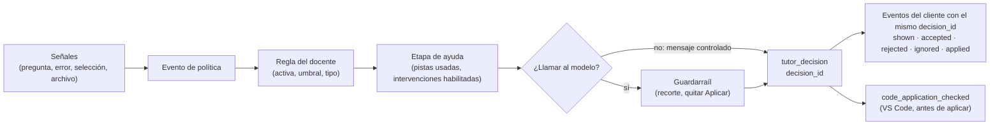

# Trazabilidad de las decisiones del tutor

| | |
|---|---|
| Jira | A5.5 · ADACEEN-59 (auditoría del razonamiento con logs interpretables y sin datos sensibles); apoya A9.8 · ADACEEN-136 (estado y trazabilidad del motor) |
| Código | `recordOverlayDecision` (`src/services/decision-engine.ts`), `recordDecision` en `/suggest-tab` (`src/routes/agent-routes.ts`), `src/routes/suggestion-routes.ts` |
| Pruebas | `tests/routes/tutor-scenarios.test.ts` (una decisión por respuesta, sin datos sensibles) |

El objetivo es poder responder, para cualquier respuesta del tutor, **por qué
respondió lo que respondió** (qué evento detectó, qué regla del docente aplicó,
en qué etapa de ayuda estaba, si bloqueó y por qué, de dónde salió la respuesta
y cuánto tardó) **sin guardar** el texto del estudiante, su código, el error,
la ruta del archivo ni su identidad.

## Cadena de una decisión



Cada respuesta genera una fila `tutor_decision` en `telemetry_events`. El
`decision_id` vuelve al cliente (`decision_id` en `/intervene` y `/suggest-tab`)
y el cliente lo pone en los eventos que siguen, de modo que la reacción del
estudiante queda unida a la decisión que la provocó.

## Qué guarda cada decisión

| Campo | Ejemplo | Qué explica |
|---|---|---|
| `channel` | `overlay`, `vscode` | Por dónde llegó la petición. |
| `policy_event_type` | `compile_error` | Qué situación detectó el motor. |
| `intervention_type` | `hint`, `explanation`, `controlled_message` | Qué tipo de ayuda dio (o el mensaje controlado). |
| `help_stage` | `hint_1`, `hint_2`, `partial_example`, `controlled` | En qué etapa de la ayuda gradual estaba. |
| `reason_code` | `ok`, `hint_limit_reached` | Por qué se permitió o se bloqueó (tabla siguiente). |
| `blocked` | `true` / `false` | Si la política bloqueó la ayuda. |
| `latency_ms` | `3120` | Tiempo total de la decisión en el servidor. |
| `exercise_hash`, `error_hash`, `context_hash` | 16–20 hex | Qué ejercicio, qué error y qué contexto, sin sus textos. |
| `metadata.source` | `ai`, `heuristic`, `policy`, `cache`, `deterministic`, `degraded` | De dónde salió la respuesta. |
| `metadata.trigger` | `cursor_idle`, `selection`, `manual`, `blocking`, `panel` | Qué la activó (VS Code). |
| `metadata.reason` | `codigo_recortado` | El guardarraíl recortó código. |
| `metadata.allowed`, `metadata.maxLines`, `metadata.remaining` | `false`, `5`, `2` | Si se podía aplicar código, con qué límite y cuánto cupo quedaba. |
| `metadata.ragSources` (overlay), `course_code` | `3`, `FPOO` | Cuántas fuentes del material autorizado acompañaron la respuesta y de qué curso. |

En el overlay con sesión se guarda además una fila en la tabla anterior
`intervention_telemetry` (la usa el panel del docente) con la política aplicada
y un **resumen de contexto** sin datos sensibles: título de la actividad, fecha
de entrega, extensión del archivo y la clase del error con su hash (por ejemplo
`Taller 1 - Cuenta | archivo .cpp | error #3f9c…`). No guarda la ruta, el título
de la página (en GitHub incluye usuario y repositorio) ni el texto del error.

## Motivos de decisión (`reason_code`)

| Código | Significa | Canal |
|---|---|---|
| `ok` | Se ayudó según la regla y la etapa. | Ambos |
| `rule_disabled` | El docente desactivó la regla del evento, o ninguna intervención habilitada sirve para él. | Ambos |
| `insufficient_context` | Faltan señales para ayudar sin inventar. | Ambos |
| `out_of_domain` | La consulta está fuera del curso. | Ambos |
| `hint_limit_reached` | Se llegó al máximo de pistas del ejercicio. | Overlay |
| `controlled_message` | La regla pide mensaje controlado por otro motivo. | Overlay |
| `code_application_disabled` | El docente no permite aplicar código. | VS Code |
| `code_application_too_large` | El cambio pasaba del límite de líneas (o el guardarraíl lo recortó). | VS Code |
| `code_application_limit_reached` | Se agotó el cupo de aplicaciones del archivo. | VS Code |
| `model_error_fallback` | El modelo no respondió o no dio una respuesta válida; se usó el respaldo. | Ambos |

## Cómo auditar una decisión

Con acceso a la base (solo lectura):

```sql
-- La decisión y todo lo que pasó después con ella
select occurred_at, channel, event_type, policy_event_type, help_stage,
       reason_code, blocked, latency_ms, metadata
from telemetry_events
where decision_id = '<decision_id>'
order by occurred_at;

-- Cuántas decisiones bloqueó la política por motivo y canal
select channel, reason_code, count(*)
from telemetry_events
where event_type = 'tutor_decision'
group by channel, reason_code
order by channel, count(*) desc;
```

Sin acceso a la base: `GET /api/telemetry/export?format=jsonl` (docente o
administrador) y filtrar por `decision_id`; `GET /api/telemetry/quality` señala
decisiones huérfanas (I5) y aplicaciones sin verificar (I6).

## Ejemplo de traza legible (S1 en VS Code, valores ilustrativos)

| Hora | Evento | Datos |
|---|---|---|
| 10:02:11 | `compile_error_detected` (VS Code) | `error_hash` `7c1e…`, `file_ext` `.cpp` |
| 10:02:14 | `tutor_decision` (backend) | `compile_error`, `hint_1`, `ok`, `latency_ms` 3 120, `metadata.trigger` `blocking`, `metadata.maxLines` 5, `metadata.reason` `codigo_recortado` |
| 10:02:14 | `vscode_suggestion_shown` | mismo `decision_id` |
| 10:02:40 | `code_application_checked` (backend) | `blocked` false, `ok`, `metadata.linesChanged` 2, `metadata.remaining` 2 |
| 10:02:41 | `suggestion_completion_applied` | mismo `decision_id`, `metadata.linesChanged` 2 |

Se lee como: el estudiante llevaba un rato con un error de compilación, el
tutor dio una pista de nivel 1 y recortó el código a 5 líneas, el estudiante
aplicó un cambio de 2 líneas con confirmación y le quedaron 2 aplicaciones en
ese archivo. Nada de eso requiere ver su código.

## Lo que no se guarda

- El prompt, la respuesta del modelo, el código, la pregunta y el texto del
  error: solo sus hashes. El worker GPU tampoco los guarda: su log registra
  tamaños y hashes.
- Ids de usuario, correos, nombres y rutas: el actor va seudonimizado
  (`actor_anon_id`) y el archivo reducido a su extensión.

## Logs de operación

Los logs del App Service (JSON estructurado) registran el `requestId`, la ruta,
el modo, tamaños y hashes cortos de las entradas y salidas, y el motivo de cada
fallo. Sirven para diagnosticar, no para el análisis: caducan a las 12 horas y
en algunas rutas llevan repositorio, ruta de archivo e ids recortados (hallazgo
H3 de la [revisión técnica](revision-tecnica.md)).
